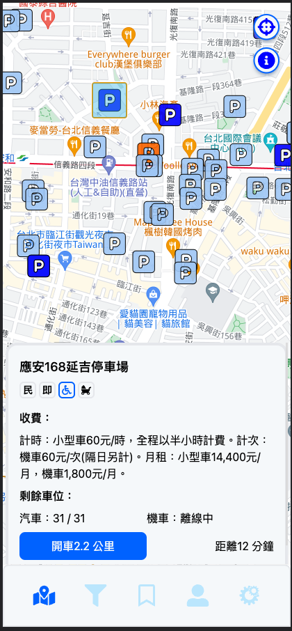
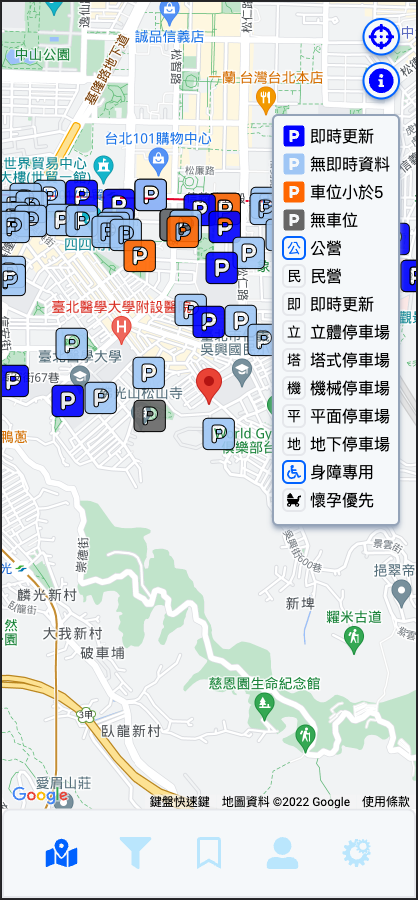

<h1>Expense-Tracker</h1>


## 基於 RCA 串接臺北市停車場資訊，提供使用者快速查詢停車位的 Web App

#### 此專案目前功能有:

- 定位功能並顯示附近1公里的停車場
- 點擊地圖會點顯點擊目標週圍 1 公里的停車場
- 移動地圖會點顯點地圖中心點週圍 1 公里的停車場
- 點擊停車場圖標會顯示停車場資訊
- 可輸入行政區、及關鍵字進行篩選

# 使用技術

```
React
Typescript
Zustand
TailwindCSS
axios
react-google-maps/api
react-router-dom
react-hook-form

```

### Demo

[佈署位置：https://tommy1023.github.io/parking-lots/parkingList
](https://tommy1023.github.io/parking-lots/parkingList)






---

# Get Started

#### 1. 下載專案

```
git clone https://github.com/Tommy1023/parking-lots.git
```

#### 2. 初始化

```
npm install
```

#### 3. 設置環境變數

```
REACT_APP_GOOGLE_API_KEY = 'your google api key'
```

#### 4. 啟動專案

```
npm start
```

