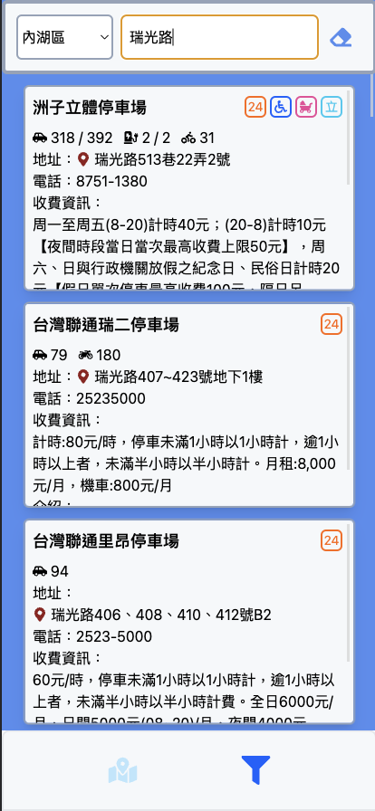

<h1>Parking Lot</h1>


## 基於 RCA 串接臺北市停車場資訊，提供使用者快速查詢停車位的 Web App

#### 此專案目前功能有:

  

- 定位功能
  - 開啟地圖後取得使用者定位
  - 顯示附近 1 公里的停車場圖標
  - 點擊定位圖標返回使用者位置。
- 搜尋功能
  - Autocompelte
  - 移動地圖至目的地，顯示目的地及週圍停車場圖標
-停車場資訊
  - 點擊地圖會顯示點擊目標週圍 1 公里的停車場
  - 移動地圖會顯示點地圖中心點週圍 1 公里的停車場
  - 以圖示搭配圖示說明簡化停車場資訊
  - 顯示停車場與使用者的最佳距離與行車時間
  - 點擊 button 啟動 Google 導航
- 圖示說明
  - 提供所有圖示解說
- 篩選功能
  - 單一條件或多條件篩選(行政區、關鍵字)
  - 顯示停車場詳細資訊
  - 點擊地扯旁圖標可以跳轉至地圖頁面

  
# 使用技術

```
React
Typescript
Zustand
TailwindCSS
axios
react-google-maps/api
react-router-dom
react-hook-form

```

### Demo

[佈署位置：https://tommy1023.github.io/parking-lots/parkingList
](https://tommy1023.github.io/parking-lots/parkingList)




---

# Get Started

#### 1. 下載專案

```
git clone https://github.com/Tommy1023/parking-lots.git
```

#### 2. 初始化

```
npm install
```

#### 3. 設置環境變數

```
REACT_APP_GOOGLE_API_KEY = 'your google api key'
```

#### 4. 啟動專案

```
npm start
```
